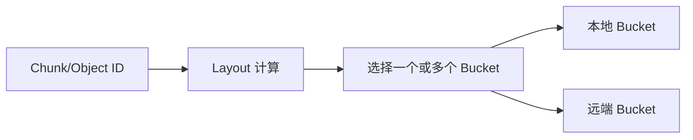
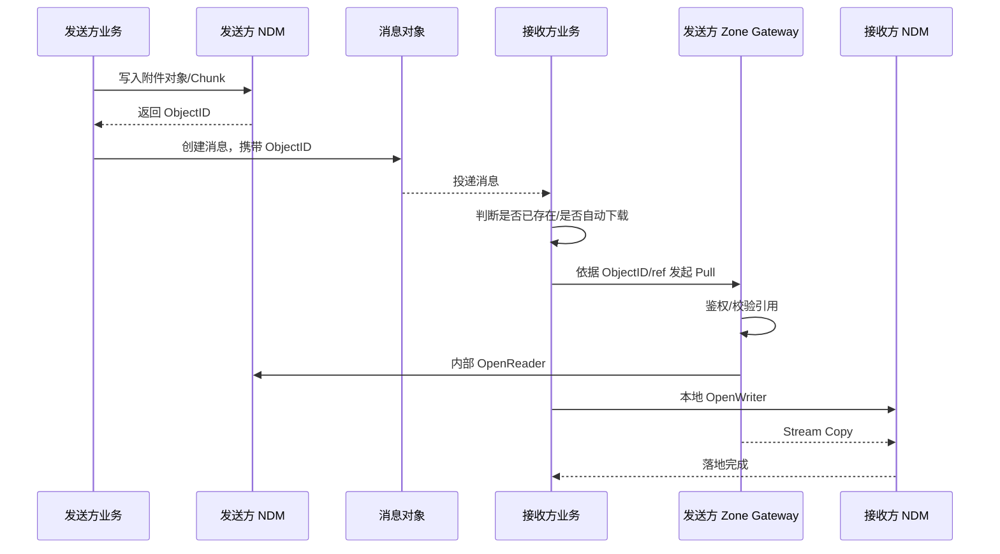
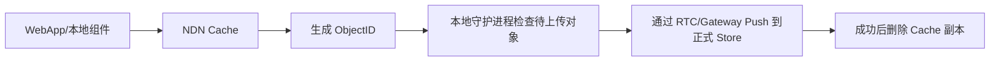

# BuckyOS Named Data Store 核心流程与关键协议

> 基于原始语音记录整理。本文对明显的口误与转写噪声做了统一修正，例如：  
> - “重 / 中 gateway”统一为 **Zone Gateway**  
> - “CIFS（cyber filesystem）”按上下文修正为 **CYFS（Cyber File System）**  
> - “pore”统一为 **pull**  
> - “rtcp / rtc”统一表述为 **RTC / RTCP 转发能力**  
>
> 同时，录音中有时将 **Store** 与 **Gateway** 混在一起描述，本文按“**存储层**”与“**访问网关层**”两层来归纳。

## 1. 目标与核心抽象

BuckyOS 的 Named Data Store（下文简称 **NDM**）面向分布式存储场景，核心目标是：在统一对象/Chunk 抽象之上，把“**数据如何落到具体桶（bucket）**”与“**如何跨设备、跨 Zone 访问这些桶**”拆开处理。

在这套模型里：

- **每个 Store 可以抽象成一个 bucket**
- 一个 bucket 在单机视角下，通常对应某个**分区 / 磁盘 / 目录**
- 如果一台存储机有 10 块盘，理论上至少可以构造 10 个 bucket
- bucket 既可以位于**本地**，也可以位于**远端设备**
- 数据写入时以 **Chunk** 为基本落盘粒度，当前假设单个 Chunk 大小约为 **32MB**

bucket 的容量设计倾向于尽量一致，因为它与故障域、数据均衡和副本策略直接相关。虽然从哈希分布上无法严格保证每个 bucket 的占用完全相同，但在 bucket 容量例如为 **100GB 级别**、Chunk 粒度为 **32MB** 的情况下，这种偏差通常已经足够小，可以接受。

## 2. 两层解耦：bucket 实现 vs. layout 选桶

NDM 的核心分布策略被拆成两层：

### 2.1 第一层：bucket 自身的实现

bucket 是最底层、最稳定的存储单元。它只关心：

- 如何保存对象或 Chunk
- 如何暴露最基本的读写能力
- 如何在本地目录/盘上管理自身数据

这一层尽可能简单、可靠，不感知更高层业务。

### 2.2 第二层：layout 文件与选桶算法

真正决定“一个 Chunk 应该落到哪个 bucket、落几个副本”的，是 **layout**。

给定一个 `chunk_id` 或其哈希值，在 layout 固定的情况下，系统可以**确定性地**计算出：

- 该 Chunk 对应哪些 bucket
- 需要选出几个副本 bucket
- 数据分布是否满足可靠性与可用性目标

这里有几个关键点：

1. **layout 只关心 bucket 集合，不关心 bucket 是否位于同一台机器上**
2. **bucket 的实现**与**bucket 的选择**是分开的
3. 系统整体的可靠性、容量上限、容灾能力，很大程度取决于 **layout 文件设计**
4. 给定 layout、bucket 容量、复制策略后，可以推导整体容量、可用副本数等指标

换句话说，系统把“复杂的分布式策略”收束到 layout；而 bucket 本身保持尽量纯粹。



## 3. 存储层访问模型：本地透明、远端经 Gateway

在 NDM 中，bucket 不一定总在本机。  
当目标 bucket 位于远端设备时，就需要通过 **Gateway** 来完成访问。

因此，系统底层访问模型是：

- **本地 bucket**：直接打开并读写
- **远端 bucket**：先根据 layout 找到目标 bucket，再通过 Gateway 转成远程读写

也就是说，**layout 负责“算去哪里”**，而 **Gateway 负责“怎么到那里”**。

## 4. 协议分层：按安全级别和性能诉求选实现

录音中强调，NDM 不会只有一种 Gateway/协议实现，而是会按照部署环境做取舍，本质是 **安全性与性能的 trade-off**。

### 4.1 极致性能场景：Raw 协议

如果满足下面条件：

- 所有机器都处于严格可控的集群内部
- 例如同机柜、同内网
- 运维侧已经通过 IP 白名单 / IPTables 等手段做了访问控制

那么最追求性能的方案，可以是一个**非常薄的裸 TCP 服务**，甚至进一步朝以下能力靠近：

- Chunk 到远端内存/存储区域的直接映射
- 类似 RDMA / Remote Memory Mapping 的访问模式

这一类协议可以称为 **Raw 协议**。  
它的目标是尽量逼近“远程内存 / 远程块设备”体验，适合完全受控的集群。

### 4.2 通用场景：Thin HTTP 协议

在更常见的场景，例如家庭网络、小型私有部署、对性能有要求但不追求极限的环境中，更适合使用一个**极薄的 HTTP 协议层**。

这里特别强调的是：

- 使用的是 **HTTP 语义**
- 不一定要求底层直接暴露 HTTPS
- 前提是设备之间的身份关系已经在别的机制里建立，彼此可信

这个 HTTP 协议层只保留最基本的语义：

- `PutObject`
- `GetObject`
- `OpenReader(chunk)`
- `OpenWriter(chunk)`

其中：

- 对象（Object）适合做一次请求完成的小粒度结构化读写
- Chunk 读写则更适合用流式 Reader/Writer 方式处理

### 4.3 Reader 支持 Range，Writer 刻意简化

Chunk Reader 应支持 **Range / 指定偏移打开**，便于按位置读取。

但在 Writer 侧，录音明确提出一个重要取舍：  
**底层 Chunk 写入不再做复杂的断点续传状态机，而是用更简单的幂等写策略。**

原因是：

- Chunk 已经被限制在约 **32MB**
- 在内网 / RTC 转发环境中，这个尺寸重传成本可接受
- 断点续传会引入额外的状态持久化与协议往返复杂度
- 分布式环境下，这类状态一致性维护本身成本很高

因此，Writer 更倾向于以下状态模型：

1. **已存在且已写完**  
   `OpenWriter` 时直接返回“已完成”，调用方无需重复写入

2. **不存在或写入未完成**  
   从头开始重新写整个 Chunk，不保留中间断点状态

这使得底层协议显著变薄。

### 4.4 Push-first，而不是 Pull-first

在存储层，核心语义是 **push-first**：

- 调用方先根据 layout 定位目标 bucket
- 然后主动 `OpenWriter`
- 如果目标端确认可写，调用方立即把数据推过去

这与后面跨 Zone 的文件分发逻辑不同。  
存储层更像“块写入协议”，而不是“业务驱动的内容拉取协议”。

## 5. Thin HTTP 协议建议形态

可以把 NamedStore 的 HTTP 协议理解为一个非常薄的远程存储访问层：

### 5.1 最小能力集

建议至少有以下能力：

- `PUT /object/:id`
- `GET /object/:id`
- `POST /chunk/:id/open-reader`
- `POST /chunk/:id/open-writer`

其中：

- `open-reader` 返回可用于流式读取的信息
- `open-writer` 负责判断“是否已存在 / 是否允许写入 / 是否应重传”
- 真正数据流传输可通过单次 POST、分阶段 Header + Body，或建立流式连接来完成

### 5.2 Helper 是加速项，不是正确性前提

协议层还可以增加一些 helper，例如：

- 快速哈希检测
- 文件/ObjectID 预校验
- 本地是否已存在的快速探测

但这些都只是优化项。  
即使 helper 不存在，系统也仍应保持正确。

## 6. RTCP：把“逻辑内网”扩展到公网分布

录音中的一个关键判断是：  
对于家庭、办公室、跨地点自建节点这类环境，系统不应只依赖传统局域网，而应支持通过 **RTCP** 构造“逻辑上像内网、物理上可能跨公网”的连接方式。

典型场景：

- 家里一台存储机
- 办公室一台存储机
- 两者先建立 RTCP 连接
- 再通过 RTCP 或等价转发能力，把前述的极薄存储协议转过去

于是，从存储层视角看：

- 本地应用仍然只是在向 NDM 写对象或 Chunk
- layout 可能把某个副本分配到“办公室 bucket”
- 写入过程会通过 RTC/RTCP 隧道，把数据送到办公室设备上的对应 bucket

这意味着：**NDM 的 bucket 视图可以跨越物理网络边界**。

## 7. 存储层与业务层的边界

一旦请求进入存储层，NDM 不再关心业务语义。

也就是说，下面这些问题应当在更高层解决：

- 谁可以写这个对象
- 是否有权限下载这个附件
- 是否是好友可见资源
- 是否允许跨 Zone 传播

而存储层只负责：

- 把对象写进去
- 把对象读出来
- 按 layout 找 bucket
- 对 bucket 执行 Reader/Writer 操作

这条边界非常关键。  
**权限、身份、社交关系、消息投递，都不应下沉到 bucket 协议层。**

## 8. 跨 Zone 文件分发：上层采用 Pull-first + 强校验

与底层 store 协议不同，跨 Zone 的文件分发不是 push-first，而是 **pull-first**。

录音里举的核心例子是：**消息系统发送带附件的消息**。

### 8.1 发送侧流程

发送方要给好友发一个带附件的消息时，正常顺序应是：

1. 先把附件写入自己这边的 NDM/store
2. 得到对应的 `ObjectID`
3. 再创建消息对象，把附件引用（如 ObjectID）放入消息
4. 将消息投递给对端

也就是说：  
**先有文件对象，再有引用它的消息对象。**

### 8.2 接收侧流程

接收方收到消息后，不是立刻盲目下载，而是先由业务逻辑判断：

- 这个对象本地是否已经有了
- 该消息是否需要持久保存
- 该附件是自动下载还是手动下载
- 是否满足本端的策略配置（例如大文件只手动拉取）

如果本地已经有该对象，就不需要再拉。  
如果策略判断应下载，则启动下载任务。

### 8.3 上层协议：录音中的 CYFS（Cyber File System）

录音里把这一层称为 **CYFS（Cyber File System）协议**。  
它的语义可以概括为：

- 面向跨 Zone 的内容访问
- 基于引用（ObjectID / ref）进行拉取
- 以 **pull-first** 为主
- 必须做更强的验证与授权检查

### 8.4 Zone Gateway 在拉取链路中的作用

当接收方要拉取一个对象时，外部请求首先到达发送方或资源拥有方的 **Zone Gateway**。

Zone Gateway 至少需要做两件事：

1. **鉴权 / 验证引用合法性**
   - 请求里应携带 ref、引用上下文或其他授权材料
   - Gateway 要确认这是不是一个合法下载请求

2. **向下调用存储层**
   - 验证通过后
   - Gateway 根据对象引用找到本地对象/文件
   - 再在内部调用底层 store 协议
   - 找到正确的 bucket
   - `OpenReader` 读出数据

接收方本地则会：

- 先在自己这边打开一个 Writer
- 远端 Gateway 打开 Reader
- 通过流复制（copy stream）的方式完成落地



## 9. 强验证：ObjectID 不只是定位符，也是校验依据

在跨 Zone 下载里，ObjectID 不只是“找到对象”的键，也应当承担以下作用：

- **完整性校验**
- **本地是否已存在的快速判断**
- **去重与跳传优化**

因此，录音中提出：

- 某些 HTTP 返回头 / HEAD 请求中，可以带上 `ObjectID`
- 浏览器或轻客户端拿到 `ObjectID` 后，可以先判断本地缓存是否已有
- 只有在确实缺失时，才真正发起下载

这对于网页、扩展、轻量缓存组件尤其重要。

## 10. 必须明确区分的两类协议

从整段录音看，系统必须同时维护两类协议，而且两类协议的哲学完全不同。

### 10.1 Zone 内 / Store 层协议

特点是：

- 面向 bucket 与 Chunk
- 极薄
- 强调性能
- 可以是 Raw / TCP / HTTP
- 语义偏 push-first
- 不承担复杂业务语义

### 10.2 Zone 间 / 文件系统层协议

特点是：

- 面向对象引用与跨域协作
- 强验证、强鉴权
- pull-first
- 与消息、分享、好友关系等业务策略联动

这两者不能混为一谈。

## 11. 浏览器上传：为什么它是独立问题

浏览器发送附件时，真正的问题不是“怎么把文件发给好友”，而是更前面的：

> **怎样把用户本地选中的文件，先变成本体系里的 ObjectID。**

只有拿到 `ObjectID`，后续消息投递、分享、转发、去重，才都能进入统一流程。

录音中把浏览器路径拆成两大类。

## 12. 路径一：纯浏览器（无扩展）

这是一定要支持、也最基础的一条路径。

### 12.1 基本约束

纯浏览器天然受限于 Web 安全模型：

- 页面侧通常只能使用 HTTPS/HTTP 标准能力
- 无法直接操作本地 NDM 进程
- 无法直接打开本地 bucket 或 NDN Cache

因此，纯浏览器必须先连到 **Zone Gateway 上一套面向已认证用户的上传协议**。

### 12.2 纯浏览器上传协议应做什么

这套协议不等同于 CYFS，而更像一个“面向 WebApp 的统一上传接口”。

它至少要解决：

1. **尽快把浏览器选中的文件传到用户后台**
2. **由后台或 Gateway 再写入实际 store**
3. **提供 helper，尽量跳过重复上传**

例如：

- 浏览器本地先算快速哈希 / 分片哈希
- 调用 helper 查询该文件是否已存在
- 如果已存在，直接返回已有 `ObjectID`
- 如果不存在，再走完整上传流程

### 12.3 这应成为统一 SDK 能力

录音里建议把这条路径收敛成一套统一 SDK / 上传接口：

- 前端 WebApp 复用统一上传协议
- Zone Gateway 或其下属文件管理模块负责服务端实现
- 各个 App 可以自定义 UI，但尽量复用同一套底层上传能力

这样可以避免每个 WebApp 都重复造上传轮子。

## 13. 浏览器接入的两种 SDK 形态

语音记录里实际上讨论了两种面向业务方的集成方式。

### 13.1 重型方式：系统服务 / KRPC 风格接口

做法是：

- 平台直接暴露一套系统级文件上传服务
- 业务方接这个服务即可得到 `ObjectID`

优点：

- 平台侧可以统一演进协议
- 功能完整
- 对业务方接入简单

缺点：

- 第三方一旦深度依赖
- 平台后续升级要承担更大的兼容压力

### 13.2 轻型方式：静态库 / 后端复用组件

做法是：

- 页面仍只和自己的后端交互
- 业务后端内部复用平台提供的 Rust 组件或静态库
- 在合适时机调用 NDM/store 协议，把 Chunk 写入系统

优点：

- 更轻
- 业务方对外协议完全自主
- 平台兼容负担更小

从录音倾向看，**轻型方式更现实，也几乎是迟早要做的基础能力**。

## 14. 路径二：浏览器 + 扩展 / 本地伴随进程

如果用户端除了浏览器，还有扩展或桌面伴随组件，那么上传链路可以大幅优化。

核心变化是：

> 页面不再只拿到“浏览器里的 File”，而是有机会直接拿到系统内的 `ObjectID`。

这会极大简化 WebApp 的业务逻辑。

### 14.1 本地组件的职责

本地组件本质上要做一件事：

- 把用户本地文件转换成系统内对象
- 产出 `ObjectID`
- 并尽可能完成或托管后续上传

也就是说，本地组件更像一个：

- 异步上传器
- 本地缓存代理
- 轻量边缘节点

## 15. 浏览器增强场景的两种部署形态

### 15.1 当前形态：桌面机本身就跑着 BuckyOS 组件

如果用户正在使用的这台 PC 上，已经跑着原生内核和相关容器/服务，那么最理想的情况是：

- 本地组件直接把文件写入本机 store
- 同步或异步生成 `ObjectID`
- WebApp 立即拿到结果

这是一跳最短、体验最好的路径。

### 15.2 长期形态：真正的 Store 在 NAS，Laptop 只有 NDN Cache

更长期、更典型的目标形态是：

- 用户的正式 Store 主要在 NAS 或独立存储设备上
- Laptop 上也安装了客户端
- 但 Laptop 上不一定承载完整 Store
- 它只运行一个轻量缓存组件：**NDN Cache**

NDN Cache 的定位不是完整 bucket，而是：

- 一个临时 bucket
- 一个可纳入系统视图的缓存层
- 一个比浏览器页面生命周期更长的上传缓冲区

这对浏览器很重要，因为浏览器页面很容易被用户关闭。

## 16. NDN Cache 的价值：把“页面上传”变成“守护进程上传”

NDN Cache 的核心意义在于：  
它把脆弱的 Web 上传过程，变成一个由本地守护进程托管的上传过程。

推荐的运行方式是：

1. 浏览器或本地组件把文件先放进 NDN Cache
2. 同时得到对应的 `ObjectID`
3. 后台守护进程持续检查哪些对象：
   - 已生成 ObjectID
   - 但尚未真正写入正式 Store
4. 守护进程通过本地完整 RTC/Gateway 能力，持续把这些对象 push 到正式存储
5. 写入成功后，再把缓存副本删除

这样即使：

- 用户关掉网页
- 网络一时较差
- Laptop 在出差环境里

上传任务仍可继续推进，而不是随着页面结束而中断。



## 17. 浏览器如何与 NDN Cache 交互

录音里提出了几种技术路线。

### 17.1 最理想：浏览器运行时可直接调用本地能力

如果浏览器扩展或自有运行时足够强，可以直接：

- 把“选择的本地文件路径”传给本地服务
- 由本地服务完成导入与对象化
- 返回 `ObjectID` 给页面

这是最直接的做法，但兼容性需要调研。

### 17.2 可行路径：在 BuckyOS App 内打开 Web 页面

如果 Web 页面并不是跑在普通浏览器，而是跑在 BuckyOS 自带 App/容器环境里，那么本地能力调用会更可控，这条路可行性最高。

### 17.3 工程折中：localhost WebSocket

录音中还提出一个很实际的方案：

- 本地起一个 `127.0.0.1` 上的 WebSocket 服务
- 页面先尝试连接该服务
- 若连接成功，说明本地 NDN Cache / companion service 可用
- 页面通过 WebSocket 请求本地服务执行 `openfile`
- 本地服务弹出系统文件选择器
- 用户选完文件后，本地服务拿到真实文件路径
- 再将选择结果与后续对象化结果通过 `session_id` 返回给页面

这条路线的优点是：

- 页面侧接入简单
- 能平滑判断本地能力是否可用
- 本地能力不可用时可自动回退到普通浏览器上传

## 18. 浏览器上传的推荐退化策略

整体上，浏览器端应采用“能力探测 + 优雅降级”的方式：

1. 先检查本地 companion / NDN Cache / WebSocket 是否可用
2. 若可用，走本地对象化路径，尽快拿到 `ObjectID`
3. 若不可用，退回纯浏览器上传协议
4. 两条路径最终都统一收敛到：
   - 得到 `ObjectID`
   - 交给上层业务继续处理

这样系统既能支持纯 Web，也能在有本地组件时获得更好的体验。

## 19. 建议的端到端统一心智模型

把整套系统串起来，可以得到一个更稳定的理解框架：

### 19.1 写路径

- 用户/业务先获得文件内容
- 文件被切分为 Chunk
- 根据 layout 选 bucket
- 在 Zone 内通过 Raw 或 Thin HTTP 协议 push 到 bucket
- 完成后得到 ObjectID
- 上层业务只传递 ObjectID 或对象引用

### 19.2 读路径（Zone 内）

- 根据 ObjectID / ChunkID
- 通过 layout 找 bucket
- Gateway 打开 Reader
- 本地或远端读取对象/Chunk

### 19.3 读路径（Zone 间）

- 接收方先拿到对象引用
- 本地先判断是否已有
- 若无，则按业务策略发起 pull
- Zone Gateway 做鉴权与校验
- 内部调用底层 Reader
- 接收侧本地打开 Writer 落地

## 20. 关键设计结论

### 20.1 系统本质上有两种完全不同的协议

- **Store 协议**：极薄、push-first、偏性能
- **跨 Zone 文件协议**：pull-first、强验证、偏业务协作

### 20.2 bucket 与 layout 必须严格解耦

- bucket 负责“能不能存”
- layout 负责“存到哪、存几份”
- 系统可靠性核心在 layout 设计，而不是 bucket 本身

### 20.3 32MB Chunk 是简化协议的重要前提

正因为 Chunk 被压在较小尺度，系统才有空间放弃复杂断点续传，转向“失败即整块重写”的简单策略。

### 20.4 浏览器问题的关键不是上传，而是对象化

浏览器链路真正要解决的是：

> 如何让一个用户本地文件，尽快、稳定地变成 `ObjectID`。

一旦这个问题被解决，上层消息、分享、去重、跨 Zone 拉取，都会自然统一。

### 20.5 NDN Cache 是连接 Web 体验与正式分布式存储的桥梁

它既不是完整 Store，也不是单纯前端缓存，而是：

- 临时 bucket
- 本地上传缓冲层
- 页面生命周期之外的守护进程支点

## 21. 后续设计中需要继续定稿的问题

根据录音，后续还需要继续收敛以下内容：

1. **Store 层 HTTP 协议的精确定义** 
   - `OpenReader/OpenWriter` 的返回结构
   - 数据流承载方式
   - 状态码与幂等语义

2. **Raw 协议的边界**
   - 是否直接走裸 TCP
   - 是否支持更接近 RDMA/映射的模式
   - 安全边界如何前置

3. **RTCP 转发细节**
   - 是透明转发 HTTP，还是承载独立数据通道
   - 连接生命周期与复用模型如何定义

4. **CYFS 拉取协议的授权材料**
   - `ref` 的结构
   - 授权校验方式
   - ObjectID 与访问能力之间如何绑定

5. **浏览器增强路线的最终选择**
   - Extension
   - 自带 App Runtime
   - Localhost WebSocket
   - 多路径并存时如何统一 SDK

6. **第三方集成策略**
   - 暴露系统级服务，还是优先提供可嵌入静态库
   - 长期兼容性如何约束

---

## 附：一句话总结

**BuckyOS Named Data Store 的核心，是用 layout 把对象/Chunk 确定性映射到 bucket，用极薄的 store 协议完成 Zone 内 push 写入，再用 pull-first 的跨 Zone 协议和 Zone Gateway 完成强校验的对象分发；而浏览器侧的关键任务，是尽快把本地文件稳定地转化为 ObjectID。**


## 附录 语音原文
```txt
是nam的name的data store,就是命名数据网关,然后这个我们现在其实底层最底层其实已经有了这样的钢性需求,因为我们是分布式系统嘛,分布式系统就意味着我们现在的定义就是每一个store,每一个store它是一个桶,桶的话它就会有一个位置,然后这个位置呢是在本机视角来看的话,它基本上是一个处在某个分区某个磁盘上的一个目录,因为我们就相当于说,如果说你以本机上来讲的话,你如果说是像传输的存储机你有十块硬盘的话,其实你是至少可以建十个桶的。然后呢,我们桶的大小我们是希望是一样的,就毕竟这是一个跟故障有关的一个事情嘛。比如说我们会假定桶大小都是一样,但是这是一种假定哈,其实从实验证明我们并不严格意义上保证保障完全完全相同的容量,因为毕竟这有哈希的概率问题对,但相对来讲,我们在限定每个chunk大小就是64兆的情况下,其实呃以现在如果说你一个桶的大小在这种呃呃举个例子,如果在这种100G这个级别的话,以今天的这个设备来讲,100G这个级别对吧,其实64兆的这个chunk其实对这个桶的大小的偏移已经很小了,这是现在的一个情况啊，那么下面一步我们很很我们现在讨论这个网关的核心就是我的桶不但可以可以在这个本地,对吧,还可以在远端,也就是说我们呃需要当当当这个桶的位置在另外一台设备上的时候,那这个时候就是这个gateway所需要发挥的发挥作用的一个地方,然后呢,我们整个的这个这个桶的寻找是用的是比较传统的呃这种这种这种我们现在叫这个反正反正一个传统的一个一个layout的算法吧,就是这个算法相当于说给定一个给定一个哈希,它可以呃确定性的得到,所以你只需要有一个固定的layout,就layout里面它都是桶哈,它并不是它并不在意呃这些桶桶是不是在同一个设备上,反正就是他在你给定一个chunkid,它会它你根据你的副本数,它会在这个桶里面选选一个或多个出来,对吧,这是我们现在的一个设定,也就是说 就是说任何设备上你只要有一块硬盘,那么只有一块硬盘你就可以进入桶,然后呢,桶的选择和和这个layout的设计是分开的,也就是说,layout就是整个系统的这个可靠性和可用性其实很大的时候是dependence on这个layout文件的这个设计,对,如果说你有一个好的layout文件的话,就是当时我们通过layout和桶的每个一百G这样大小的一个向量器,也可以算出来系统的容量是多少,对吧,包括部分数这些东西。就相当于说说这个我们把这个这个策略分布策略分成了两两个环节,就对象说两个环节,一个环节就是本身是这种简洁可靠的复杂,都是一个桶的实现。然后另外一个就是根据topooltopool的话,构成一个layout,然后从layout里面选择一个桶。

我们现在很明显根据不同的安全级别,就是说相当于说我们应该会有不同的gateway实现,因为这里面说到底是一个安全和性能的一个tradeoff的问题嘛。就比如说,如果说我假设我所有的机器都在一个机柜上面,对吧,然后呢,通过一个顶级,一个这种专职的运维吧,进行了IPtable的这种IP级的访问。那这个时候来讲,最纯粹的这个就是说性能最好的可能就是一个裸的TCP服务就可以了。这个裸的TCP服务它其实解决的其实就是,它其实就是做chunk的这个映射,甚至说可能有些机器让它直接可以做rd那个远程内存映射嘛,就是叫什么remoteRemoteMemoryMap,对吧,它可以做这个内存映射。就是说呃如果说当然这都是属于属于其实本质上讲,这都是你绝对可控的一个cluster,就是说你是可以做最高性能的,对吧,那比较正常的情况下来讲,我们从各种各样的呃如果说你对性能没有那么极致的要求,比如说我们现在的家庭环境里面,对吧,那你这个其实其实其实呃比较比较常规的一个选择还是用HTTP协议去实现,注意这里不是HTTPS,对吧,还是标准的HTTP协议,就相当于说你假设设备之间的这个身份你是可以互相互相之间认可的,对吧,那这个时候来讲的话,呃你就应该应该应该用HTTP是呃就就就直接的HTTP就可以了。那我们这个其实呃语意来讲,相对来讲来讲也也也从从这个中gateway的角度来讲,其实相对来讲也比较纯粹啊,无非就是小粒度的对象,这个这个结构化的东西,这个put一个object,get一个object的,这个就是一次HTTP请求就能完成了。然后呢,chunk就是就是它其实就是各种各种流,对吧,reader,writer。然后呢,reader这一块来讲的话, 它是这个它应该是说呃是就是说我们其实redis支持这个range,就是说你是可以在打开的时候是可以去指定一个位置的然后write因为这是个底层接口哈,所以说我们其实虽然说我们系统上呃可能到这一刻了,就原来我们的这个因为原来我们窗口没限制大小啊,所以我们其实窗口本身是支持这个这个所谓的呃应该叫什么,应该叫做对比较断点续断点断点上传吧就相当于说我们原来是有一套基于呃原来有一套机制,就相当于说每一次去open一个窗口writer的时候,你是可以知道他写了多久的你写了多久之后呢,你就可以可以继续写是吧但当时说这这套东西本身来讲,它有有状态持持续化的一个需求啊对吧,然后在分布式环境下,其实我现在更加倾向于说反正一个窗口也就64兆对吧,如果是在内网环境下这个这个写飞了就写这个块这个没必要断点续传,就就写的过程中断掉了,对吧,那你其实其实这个这个事情还挺精细的,一致性还挺精细的,就是说你虽然说我们原来还是做得比较精细,对吧,就是说是最后一步才落那个进度进度保存的嘛,一个一个一个这种呃对应的这个断点续传的状态文件但但总之还是引入了引入了复杂度,特别是在协议层对吧,协议层可能还得还得交货好几次对吧,所以说呃站在对这个fright的这个这个这个替换的角度来讲的话,其实呃我从从这个协议角来讲,我现在更加倾向于说这个每次每次写它就是几种几种状态第一种就是我已经写完了,对吧,你这个这个你告诉我你打开的时候打开写的时候,他告诉你窗口已经存在了,已经写完了,对吧,那你就就就就就直接返回就好了,就是窗口已经存在了,你没必要再写了。 然后另一种情况就是我这我就是没写完,那没写完永远都是从从头开始写,没有什么状态,反正也就64兆,最多64兆数据而已嘛就以我们这个规模和现在的网络体验来讲,我觉得呃特别是我们现在把大部件也都全拆成小串口,我觉得呃为了简化协议,我们也不用做这么复杂吧 这个是在http层面来讲,就相当于http本身,我们可以做比较简单的协议啊,如果这个这里面的gateway跟我们之前的这个gateway是不同的,因为我们这里以前都是假设它是直连的,毕竟这是一个特别底层的一个组件,它不会说像之前那样还要通过这个gateway绕好几道才可以,它就是尽可能的去实现一个远程的文件的打开。

我们这个这是这个应该说是从协议层面上讲,我们会有两类协议,一个是我们称之为肉协议,这个肉协议的话,尽可能的接近远程内存管理这种内存映射的这种逻辑。然后第二个就是还是httpbase的,就是说换句话讲,还是会设计一个很薄的http语义,这个语义里面只有最原始的object的这个put和get,然后chunk的这个openreader和这个openwriter,我觉得这个就基本上基本上已经足够了。当然可能还会提供一些比如像一个对一个文件的这种qcid的这种快速哈希的这种检测的一些逻辑,就一些helper吧,这都属于属于这个属于实际使用中针对一些场景上的一些helper,但即使不支持的话,其实也就是也就是也就是说helper是用来加速用的,它不会导致说东西不正确,对吧。所以说我们需要设计一个极薄的一个http层,而且这个这个层面的话,它其实是主动的,就是说它不是这个pull first的,它其实是pushfirst的,因为因为因为因为简单嘛,相对比较简单,就是说说我都已经到store这一层了,对吧,那store这层你告诉我没有了,就是说我第一步永远都是就我openwrite的时候,其实你已经已经已经已经告诉我告诉我有还是没有了,对吧,如果说没有的话,我就直接就我就openwrite成功,我就开始写了,当时站在http协议的角度来讲,来讲,其实这个postpost的其他就相当于说说我会我们传统还是用用的是这个这个这个post的协议啊,就是相当于说应该怎么讲,就是说我我post的时候,我带当时也可以说做两条,对吧,先发个header,header就是类似stat,对吧,发个header协议过去,然后然后再再去传,但即使用post的话,其实无非也就是等这边等返回的response过来了之后,我这边才开始开始开始传数据嘛 对吧,这个基本上讲是一个这样的一个基本的一个协议设计,非常的薄。然后呢,我们再往下的话,我们就会到达第一个第一个复杂点啊,就是说我们我们这种家庭网络,其实我们叫做通过rtcp,我们是可以实现那种看起来逻辑上是内网,但其实上可能分布是公网的一种结构。那在这个这个这个节点的环境下的话,我们嗯,我们的store环境,其实我们是可以在这个环境下应该是要人直接跑的。也就是说呃我办公室有一台有一台存储机,然后呢,我的这个,这个家里面有一台存储机,然后他们通过rtc协议,对吧,他们用就不再是https啊,就是说因为毕竟呃这有证书的问题对吧,就我们用rtc协议连连好之后呢,它通过这个rtcp转发实现的这个刚刚的这个http纯纯http协议的转发,它也能够做到说是是这个就一致的逻辑吧,就相当于说呃相当于说对于这个我在我在我家里的这个设备上的机一次这个传统的创数字写入来说的话,就是说它会根据这个layout分布,有的时候会通过rtc协议写到那个办公室的那个桶里面去,这个事情是我们可以接受的。对吧,所以这是一个完全完全预类的一个事情啊,也就是说呃一旦进入预类,那么这个nimbusstore这一层,这个对象管理这层,它是没有看不到业务逻辑的,就不管任何业务传到上面来,就跟写文件一样,就对象存储嘛。就他压根不关心这个这个业务是这个业务业务的这个是谁来写这个object,权限啊这些东西都在都在上面搞定了。他看到的就是说okay我要写一个写一个对象,然后我把这个对象写完

然后我们不可避免的会有这个业务的问题嘛,那这个最常见的业务就是比如说我现在用我们的系统这个system我们发这个创建了一条message object给远端,那给远端这个远端就是给你的朋友吧,给好友,那这时候来讲他的这个处理流程里面,对吧,就是你肯定是已经把这个文件已经写在本地,已经写在自己的那么的时候,你才会创建出这个消息对象来嘛,那你的朋友拿到这个消息对象的时候呢,他会发一个这个这个pore消息发个pore,就是他会发一个pore协议,那么这个pore协议的话他就会落到它是中外的请求啊,所以说他收到消息之后他决定把这个文件,就他首先第一个他判断他本地有没有,因为我们在很多在互联网世界很多是一个文件,文件不断地转发来转发去嘛。 如果他本地其实其实你发的消息你用的文件它之间已经搜到过了,它压根就不会破了,对吧。所以说这里来讲的是说这是另外一套协议,就我们的我们我们这个协议是正式命名的,我们叫CIFS协议,就是说它是作为这个cyberfilesystem,就是他相对说把所有的呃所有的人的域域看成一个逻辑文件系统这样的设计来做的。那这个时候来讲,这个文件系统里它的它的语义是porefirst的,它不是pushfirst的,它跟统不同。 就是说刚才文件系统的角度角度来讲,统更像是块协议,更像是块协议,它没有任何的语义,那pore这边来讲的话,因为它涉及到跨作嘛,所以它自己有线性能的问题。就比如说呃站在这个好友的这个角度来讲,对你的好友的那个那个OOD,它的这个总的角度来讲,他收到一个消息之后,他会有一堆业务去决定这个消息要不要要不要存。对吧,如果说决定这是个要存的消息,对吧,是跑友发来的嘛,那么它会触发一个逻辑判断,这个消息带的这个附件的大小,这个大小是触发的是手工下载还是自动下载,对吧,这取决它自己的配置。如果是是是是这个自动下载的话,那么时候它会启动一个呃类似于叫做叫doffice下载的这样的一个task。那这个task的话它就会呃去通过CIFS标准协议拿到这个 这个objectID去我们的这个就去这个我们自己的这个这个这个中的这个中gateway上去取,就是在中gateway上看来,这就是一个标准的来自于https的一个一个一个一个http请求,然后呢,它在这个请求,我们这里面肯定会有一个重级别的,比如说叫做这个这个的这个这个gateway, 然后这个这个它其实是原来标准gateway的一个一个一个组件了,对吧,那这个组件里面它想要做的事情就是第一个,我们这个请求过来它肯定有reference,对吧,肯定有那通过这个ref的话,它会判断说它是不是一个合法的一个请求,对吧,是不是一个就是换句话说就做权限控制嘛,你得给我足够权限控制的相关的信息,反正呢如果有足够的权限控制信息之后呢,他再去本地从桶里面去找到这个filesystem去打开,找到这个文件去打开,然后呢,这个时候呢,它就会在这一层的内部,就是换句话讲,它在这个这个业务逻辑的内部再去使用我们前面说的说到的这个这个的这个底层的这个 它存储层的这个协议去找到正确的store,就打开正确的桶,对吧,去OpenReader去把这个文件给拿出来,对吧,然后到了那边也是一样的,朋友那边他这个文件他在那边在破的时候,然后他破的时候,他其实当时我们从变成上讲的肯定是先开一个,他既然就他已经拿到object的IP了嘛,所以他会在他的本地的这个存储这一层,先开一个Reader,对吧,然后这边呢http这边开个这个,他那边先开个Writer,然后再把这个Reader和Writer这个copystream就连在一起,对吧,然后就就开始开始传了。然后这里的不同在于呢,在于因为因为在这个好友的角度看来,这个这个这个文件是中外的嘛,所以说它我们的服务协议也约定了一些这个跟就是跟跟验证相关的一些信息吧。也就是说,呃协议本身,对吧,就告诉了你说这个这个就说有的时候有的时候可能你获取这个文件的时候是通过一个呃是通过一个标准的那种http的那种链接你拿到的,那这个时候我们会在这个head里面带上object的id,对吧,这个这个ID其实就可以帮助你说呃第一个是你可以做校验,第二个是可以让你快速的进行本地是否存在的一个判断,就比如说你如果说换句话说,在我们的这个规划里面,就像浏览器这种功能功能比较差的这种组件啊,如果说你用扩展就可以实现这个http在浏览器里面去拉一个页面里面有好多好多好多文件的内页面的时候,如果说这个文件里面已经带上了这个object的ID,那么可以快速的在浏览器能够访问的呃这个叫NMCache啊,就浏览器本身并不能够呃实现完整的这个协议嘛,那么它就可以做一些去抽,所以这里面我们先讲这个不要讲浏览器浏览器上。我们待会儿等会儿再讨论啊,就至少现在正在现在这一刻的这个讨论来讲的话,我们其实我们要区分重与重之间的这个协议,还有我们这个本地的这个呃在一个重内的这个这个存储协议的区别啊,这个他们本身的核心区别还是在于呃是破语还是这个push语音,然后它是是不是强验证的。

然后最后我们讲一下浏览器的问题,对吧?那我们绕了一圈回来哈,我们现在已经知道了这个我们一定会存在两类协议的。那么当在浏览器里面,我们刚刚还是回到这个最原始的地方,就我如果说我在呃我们还是给我发发这个发文件的场景啊,那那用户可能他使用的我们这个messagehub的客户端,它就是一个webapp,那他这个webapp里面,他却发去真正的发送一个带附件的一个文件的时候,它其实它的第一步啊,它的第一步其实是要把它本地的就是在laptop的文件这个上传上传到就是刚刚讲的就是它得怎么样都得把这个文件给放到那个它本地的那个store里面,它才能够触发后面的这个这个真正的向另外一个做我们去投递消息这个过程嘛。那么它这个过程里面它其实就是有不同的路径选择啊,有不同的路径,它有几种情况。就第一种情况,它是一个纯浏览器,这个纯浏览器没有任何的扩展,对吧,就是现在的标准浏览器,那时候他做的事情是非常的有限,就是说相当于说呃因为因为浏览器怎么说,它都是用https协议的嘛,那这个时候它它既然用https协议,它就只能到中gateway,所以说这个中gateway这里面有一个呃面向已认证用户的一套一套协议,这个协议其实不算是cly协议啊,只是说是一套标准,就这个标准只是为了简化我们内部APP就不用每个人都做一套上传了,对吧,这套上传里面的特点就是说OK它其实处理的就是标准的那种那种传统的http分片上传这样的一些细节,对吧,它要做的事情就是呃首先第一个,这个尽快尽可能的把这个本用户呃拖到这个拖到浏览器的一个文件,尽可能快的上传到呃上传到这个中gateway里去,并且中gateway会把它调用相关的接口写到那里的store里,对吧,这是这是这是这个第一个,然后第二个呢呃会提供一些helper函数,就这些helper函数的路径就是看这个文件是不是之前已经上传过了,对吧,就我拖一个文件进去,我可以在本地先算,呃在浏览器里可以算个哈希,对吧,如果这个哈希,这个这个这是个快速哈希啊,分片的哈希。如果说呃这个这个接口提供的helper说这个文件已经之前上传过了,这个那它这个这个就可以跳过,对吧,所以说呃这是一个呃这是一个通用的 这个APP其实应该是属于webAPP的一个SDK的功能吧,对吧,就说我们会有提供就相当于这个SDK这个这个是两头都有,一方面是中gateway,对吧,就是说里面,然后我们这里面应该是这个中gateway里面下属一个系统的这个这个这个文件管理模块了,它文件管理模块有提供一个这样的标准的上传协议和SDK的一些支持。然后不同的UI的话,因为不同的设备API它有自己的UI风格嘛,对吧,就它它这个可以就做,不同的不同的APP可以做自己不同的这个上传界面,但它本身的话,它我们鼓励它用这套上传接口去把这个文件塞到它的后台服务上去。对吧,所以这是这是一个呃最基本的一个呃就是说属于啊第一条啊,这条其实主要还是各种就各种路径的选择,对吧,第一种是呃用户直接用他自己的业务业务界面接这个这个这个接口,然后完了之后上传,对吧,在它看来就是ok,这边只要接fios接口就能上传了,上传完之后得到个fileobjectID就搞定了,对吧,然后后面的话,我的fileobjectID再发到我自己的业务逻辑里去,然后另一种就是我我根本就不连什么fios,对吧,我直接连我自己的后端,然后那我的后端我的后端里面就我可以去复用这个fios的组件,对吧,fios的这种rust的组件嘛,对我复用一下,然后复用好了之后呢,ok我在这边我处理好了之后,其实我说到底我就存到那本server去了嘛,就是说两种sdk使用方法吧,对吧,第一种第一种是把这个把它当成一种系统的这个呃KRPC服务去开,对吧,这个就相对来讲重重型,我们的这个这个功能重型一点,好处就是它的整套的这个后台实现呃都是跟我们的这个这个这个协议是可以跟着升级的,这个缺点就是我们作为这个平台方来讲的话,就一旦让第三方开始用上去依赖这个东西的话,我们其实升级的这个上下兼容的这个呃这个压力就是相对比较大的。另一种就是OK,我们给你提供的其实本质上是个静态库,对吧,就是说从协议角度来看,这个这个其实都是你自己的协议,就是你自己的页面跟自己的后台打交道,对吧,然后系统看起来就是说OK,你的后台里后台里总某一个某一个点的时候呃触发调用了这个numbstore的这个同协议,对吧,把一个chunk给放进来了。 对吧,所以说从更轻一点的角度来讲,肯定还是后面那种,反正那个协议肯定早晚肯定都得做的嘛。对吧,所以说这是这种,应该说是浏览器里的这种第一个,就是我们百分之百要做的情况,就如果一定要做的话,这个东西百分之百是要做的,这不可能绕得过去。


然后第二个就是浏览器带扩展,就开始进入第二种情况了,我们有几种可能的拓展方法,当然最爽的一点还是我们直接就是那种类似于extension可以对longtime做扩展了,这个是最开心的,对吧,就相当于说,用户在这里的时候,他其实他就已经不再像浏览器外挂上传的时候看到的是一个这个这个fileid了,对吧,就可能他在,就是说说到底就是我们有机会通过扩展实现说他拿到的就是fileobjectid,也就是说,呃,说我们一个本地组件,一个本地的组件已经完成了本地文件到fileobjectid的一个转换。那这个时候他拿到的是一个这个这个在浏览在webapp看来哈,他拿到的是一个filefileid还是一个这个这个fileobject的,其实是有根本性的区别的,对吧,如果他们能直接拿到我们体系里的这个ID的话,它其实它的业务逻辑就分变简单了,对吧,那那另外一个就就反过来,我们就反推它,那这个时候我们这个本地组件有什么功能呢?其实本地组件它其实就是一个异步的一个upload,甚至说可能是一个外挂节点吧,就说有这里面又分两种情况,一种情况就是我们现在这业务逻辑实际的情况就是说,我们现在我们现在这个东西就是desktop版嘛,对吧,就用户现在很多体验8个是desktop版。但是它是什么版?什么意思呢?就是说我们整套整套分布式系统其实是以这个呃呃就是说内核部分是原生的,然后iPP是以docker的方式就跑到用户的PC上。那如果说用户刚好用在用用在用这台电脑去使用这个webavz很常见嘛,那这个时候来讲的话,其实你是有我们是有机会在这个本地组件里面就直接一步到位的就就给他objectid的时候,这个store里面也写好了,因为就这一台设备嘛。 对吧,这是最少的时候,对吧,那这个这个另外一个情况是什么呢?另外一个情况就是就是说OK我这个呃我这个机器,这这是个长期情况啊,就我这个这就是一个简直分布式系统,对吧,用户这个这个这个这个我们所我们所希望的这种呃正规用户对吧,他的这个这个stores一定是在NAS这样的这个呃这种这种没平没没这个这个设备上,那么在laptop上面呢,我还讲他也装了我们的软件,但是我们的软件里面他就有一个类似叫做我们叫现在的名字叫ndncache的一个东西,就它是一个cache组件,就是他做的事情就是就是说他不是一个完整的store,他不是一个完整的桶,但是呢,他可以作为一个呃可以作为一个所谓的临时桶吧,就临时桶可以挂掉系统里面,对吧,挂掉系统里面,就相当于说呃 其实他可以让我们,我们有机会在就是说有机会在因为webapi有一个比较痛苦的一个点,就是他的页面很容易被用户一不小心关掉嘛对吧,那他这个桶的存在周期,他这个所谓的外挂或者叫cache桶存在的周期,其实一般是跟这个电脑这个laptop本身的这个这个桌面的生命周期走了,就存在时间长一些,对吧,那就相当于说呃在这个过程中,他又有这个本地有完整的rtcp协议的网关,对吧,那我们相当于说我们就可以实现说,说说第一个是说可以直接在本地这个这个就用用daemon的方式去跑跑这个chunkpush循环,对吧,另一个是也是说有有有机会让呃有机会让这个一些业务吧,就就就是说有一些业务去走这个走走直接pool,但我现在还是更加倾向于说说在本地本地的这个服务,本地的服务就是直接用用storage层的协议,直接做这个push循环就好了,就是说反正它是laptop可能在在在这个出差可能网速没那么快嘛,但没关系,反正放在本地的这个本地的这个这个这个那个那个那个服务嘛,它会在这个时候就像一个upload的服务对吧,它不断的把cache里面没有没有就是说对象已经ID已经生成,但是还没有写入story的这个,它状态非常简单,它就是判断这对象有没有写到stor去。对吧,如果写到storage,它就从cache里删掉,然后它会去尝试的把它都都东西都给都给都给都给上上上吧,它就不会说呃说webUI本身的这种容易关闭的一个问题啊。

然后浏览器要跟这个NDN Cache进行交互,它就还是需要有协议的吧,就是说呃,这里面有几种几种,大家有几种技术路线啊,然后最爽的一点肯定直接在longtime直接掉,对吧,那longtime里面直接掉的话,就意味着说这个浏览器的longtime我们已经侵入了,对吧,那它其实相当于说,当然说标准的浏览器的extension还是会有一些能力限制,但至少是说至少可以拉到本地,就是我们其实要做的事情就是你能不能给本地的一个服务发一个消息,告诉它,我要我要把哪个文件放到cache里去,我要的是一个本地的路径,对吧,你把路径拉过来之后呢,我返回一个对象ID回去,对吧,这就是我们要的一个一个逻辑,对吧,这个呃有几种,这个可能是我们需要去去去研究它哪种哪种实验方式是最兼容性最好的啊,对吧,extension用户要装要装扩展,对吧,然后另一种就是我们本来也有8QOSAPP,对吧,你在8QOSAPP里面打开这个就可以用,这是肯定可以的,对不对?这100%可以,对吧,这条路线是肯定OK,但那里要怎么实现比较好,对吧,还有一种是现在的这个这个一种安全上的一个一个小后本吧,就是我们可以用这个websocket的,就我们那个那个东西,它在本地有一个有一个就是相当于说起一个websocket的服务嘛。现在好像是页面是可以直接呃广压七的点0001的这个websocket的去连接之后不会触发这个https的这种警告的,对吧,那这个时候来讲他连上去说他干嘛,他其实就是一个事情,就是open就是openfile,这个这个他就是打开文件选择器,就是他给一个sessionid对吧,然后完了之后告诉他说我需要呃选选择一些文件,就是他就触发了文件选择嘛。那这个时候来讲的话, 呃,我们我们在我们自己的那个numbercache的那个进程里面,对吧,在桌面版里面他就会触发这个系统的那个文件选择框,然后的话又会在里面选文件,那选文件选好之后,那我们自己就知道什么文件了嘛,那么我们完了之后他拉这个sessionid拉这个sessionid之后,他再通过这个就在这个websocket的嘛,然后再通过这个websocket他得到这个sessionid对应的这个选择结果就好了,对吧,这个是我们呃想的这个东西的实现的呃一种方法,就这样的话,即使是就相当于说本地本地他做他其实他做的事情就是说他判断这个websocket的连不连得上,连得上就说明那datacache可用,可用的话就用这个websocket的协议去去这个选择文件,如果不可用,对吧,那他就走走原来的老的路径。
```


